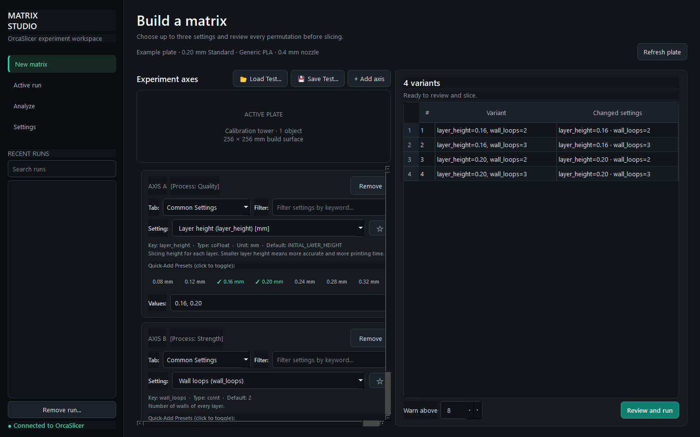
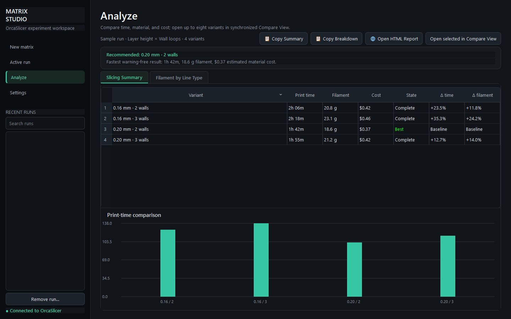

<p align="center">
  
</p>

<h1 align="center">OrcaSlicer Matrix Studio</h1>

<p align="center">
  <strong>Turn slicer settings into controlled experiments.</strong><br>
  Build a matrix, slice every variant, measure the tradeoffs, and inspect the G-code side by side.
</p>

<p align="center">
  <a href="https://github.com/schwaaaat/orcaslicer-matrix-tool/releases/latest"></a>
  <a href="https://github.com/schwaaaat/orcaslicer-matrix-tool/releases/latest"></a>
  <a href="LICENSE"></a>
  
</p>

<p align="center">
  <a href="https://github.com/schwaaaat/orcaslicer-matrix-tool/releases/latest"><strong>Download the complete Windows build</strong></a>
  ·
  <a href="docs/WINDOWS_RELEASE.md">Installation guide</a>
  ·
  <a href="RUN_BUNDLE_SCHEMA.md">Run-bundle format</a>
</p>

---

Matrix Studio is a Windows-first PySide6 workspace for designing, slicing, and analyzing OrcaSlicer setting matrices. It connects directly to the token-authenticated Remote API in the companion OrcaSlicer branch, preserves the active configuration, and stores each experiment as a portable run bundle.

The native Compare View opens up to 32 stored variants in pages of eight synchronized G-code previews, so a setting change can be inspected instead of merely timed.

## One workspace, every permutation



Choose one to three axes, use quick presets or any of 800+ indexed settings, and review the complete Cartesian product before a slice begins. The first baseline slice supplies a wall-clock ETA before Matrix Studio continues through the matrix.

## Results you can act on



Compare print time, filament, material cost, warnings, and deltas in one table. Export an interactive HTML report or send selected variants directly into OrcaSlicer's synchronized Compare View.

> The screenshots use synthetic sample results and are rendered from the real Matrix Studio widgets.

## How it fits together


| Build | Measure | Compare |
|---|---|---|
| Up to three simultaneous settings | Real slice time, filament, cost, and warnings | Up to eight synchronized previews per page |
| Quick presets plus 800+ searchable keys | Baseline-relative deltas and recommendations | Portable `run.json` bundles with HTML reports |
| Hard 32-variant safety cap | Crash-resilient state and restoration records | Searchable local run history |

## Download for Windows

Prebuilt Windows x64 packages are available from the **[latest GitHub release](https://github.com/schwaaaat/orcaslicer-matrix-tool/releases/latest)**. No Python runtime, compiler, or source checkout is required.

- **OrcaSlicer + Matrix Studio** — recommended. The complete portable OrcaSlicer build with Matrix Studio integrated into the menu.
- **Matrix Studio standalone** — the companion desktop application for an existing compatible Matrix Studio-enabled OrcaSlicer build.

Extract the entire ZIP into a new folder before running it. Keep `tools/OrcaMatrix` beside `orca-slicer.exe`; copying only the executable will break discovery and resources.

See the **[Windows release guide](docs/WINDOWS_RELEASE.md)** for checksums, installation, architecture, troubleshooting, and the complete release history.

## What makes it safe

- **Guaranteed restoration** — targeted settings are snapshotted, reset to baseline between variants, and restored in a `finally` block.
- **Recovery records** — a failed restoration sets `recovery_required` in `run.json` instead of silently leaving OrcaSlicer modified.
- **Bounded matrices** — soft warnings default to eight variants and the hard limit is 32.
- **Secure local authentication** — OrcaSlicer passes its live token through the child environment, never the command line.
- **Portable results** — atomic v2 run bundles remain useful when copied to another machine; SQLite is only the local search index.

## API-token behavior

For launches from the integrated OrcaSlicer menu, Matrix Studio receives the current in-memory token through `ORCA_API_TOKEN`. For standalone launches it restores the credential from Windows Credential Manager, then uses OrcaSlicer's configuration as a local fallback.

Desktop token priority:

1. Live parent-process `ORCA_API_TOKEN`
2. Windows Credential Manager
3. Local OrcaSlicer configuration fallback

The legacy CLI additionally supports `--token`, `.mcp.json`, and environment-driven automation.

## Run from source

Requires Python 3.10 or newer:

```powershell
python -m venv .venv
.venv\Scripts\python -m pip install -e ".[dev]"
.venv\Scripts\python matrix_tool.py
```

Enable **Remote API** in the matching OrcaSlicer build, load a model, then launch Matrix Studio from OrcaSlicer's menu or directly.

Build the portable Windows application with:

```powershell
./packaging/build_windows.ps1
```

The onedir result is written to `packaging/dist/OrcaMatrixStudio` and is designed to live beside OrcaSlicer under `tools/OrcaMatrix`.

## Test suite

```powershell
python -m pytest -q
```

The suite covers setting resolution, Cartesian-product planning, limit enforcement, portable run bundles, API compatibility, Qt builder behavior, config restoration, baseline ETA gating, cost calculation, and end-to-end orchestration.

## Legacy CLI

<details>
<summary>Show legacy v1-compatible CLI examples</summary>

Slice a two-axis matrix using canonical OrcaSlicer keys:

```powershell
python matrix_tool.py -a "layer_height=0.16,0.20" -a "wall_loops=2,3" -o ./compare_output
```

Human-readable aliases are also resolved:

```powershell
python matrix_tool.py -a "layer height=0.16,0.20" -a "wall count=2,3"
```

Use `--yes` for non-interactive runs, `--dry-run` to validate a plan without slicing, or `--config matrix_config.json` to load axes from JSON.

Legacy runs produce `manifest.json`; new desktop runs use the portable v2 `run.json` format documented in [RUN_BUNDLE_SCHEMA.md](RUN_BUNDLE_SCHEMA.md).

</details>

## Project links

- [Latest Windows release](https://github.com/schwaaaat/orcaslicer-matrix-tool/releases/latest)
- [Matrix Studio-enabled OrcaSlicer source](https://github.com/schwaaaat/OrcaSlicer/tree/matrix-studio-v2.0.3)
- [Windows installation and troubleshooting](docs/WINDOWS_RELEASE.md)
- [Compare manifest schema](COMPARE_MANIFEST_SCHEMA.md)
- [Run bundle schema](RUN_BUNDLE_SCHEMA.md)

## License

Released under the [MIT License](LICENSE).
